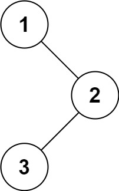

大家好，我是木川，日更写作中，喜欢这个文章系列的朋友可以关注我，一起进步。

# 一、题目描述

给你二叉树的根节点 root ，返回它节点值的前序遍历。

https://leetcode.cn/problems/binary-tree-preorder-traversal/description/

## 一）输入

root = [1,null,2,3]



## 二）输出

[1,2,3]

# 二、思路

## 一）什么是前序遍历？

前序遍历是中左右，每次先处理的是根节点，然后再处理左孩子，最后处理右孩子。

## 二）递归如何实现？

递归算法的三个要素。每次写递归，都按照这三要素来写，可以保证大家写出正确的递归算法！

### 1、确定递归函数的参数和返回值

确定哪些参数是递归的过程中需要处理的，那么就在递归函数里加上这个参数， 并且还要明确每次递归的返回值是什么进而确定递归函数的返回类型。

```
func traverse(root *TreeNode) {

}
```

### 2、确定终止条件

写完了递归算法, 运行的时候，经常会遇到栈溢出的错误，就是没写终止条件或者终止条件写的不对，操作系统也是用一个栈的结构来保存每一层递归的信息，如果递归没有终止，操作系统的内存栈必然就会溢出。

```
if root == nil {
    return
}
```

### 3、确定单层递归逻辑

确定单层递归的逻辑： 确定每一层递归需要处理的信息。在这里也就会重复调用自己来实现递归的过程。

```
res = append(res, root.Val) // 处理根节点
traverse(root.Left) // 递归处理左孩子
traverse(root.Right) // 递归处理右孩子
```

## 三）迭代如何实现？

迭代法实现递归的效果，就要用到栈，递归的本质就是栈（先入后出），先访问根节点，然后压入右孩子，最后压入左孩子，栈为什么要先加入右孩子，再加入左孩子呢？ 因为栈的特性是先入后出，这样出栈的时候才是中左右的顺序。

```
// 处理根节点
res = append(res, node.Val)

// 右孩子入栈
if node.Right != nil {
    stack = append(stack, node.Right)
}

// 左孩子入栈
if node.Left != nil {
    stack = append(stack, node.Left)
}
```

# 三、代码

## 一）解法 1 - 递归

```
func preorderTraversal(root *TreeNode) (res []int) {
    var traverse func(root *TreeNode)
    traverse = func(root *TreeNode) {
        if root == nil {
            return
        }
        res = append(res, root.Val)
        traverse(root.Left)
        traverse(root.Right)
    }

    traverse(root)
    return res
}
```

## 二）解法 2 - 迭代

```
func preorderTraversal(root *TreeNode) (res []int) {
	if root == nil {
		return res
	}
	stack := make([]*TreeNode, 0)
	stack = append(stack, root)
	for len(stack) > 0 {
		// 弹出
		node := stack[len(stack)-1]
		stack = stack[:len(stack)-1]

		// 访问根节点
		res = append(res, node.Val)

		// 右孩子入栈
		if node.Right != nil {
			stack = append(stack, node.Right)
		}

		// 左孩子入栈
		if node.Left != nil {
			stack = append(stack, node.Left)
		}
	}

	return res
}
```

## 三）解法 3 - 迭代

```
func preorderTraversal(root *TreeNode) (res []int) {
    stack := make([]*TreeNode, 0)
    for root != nil || len(stack) > 0 {
        for root != nil {
            res = append(res, root.Val)
            stack = append(stack, root)
            root = root.Left
        }
        node := stack[len(stack)-1]
        stack = stack[:len(stack)-1]
        root = node.Right
    }

    return res
}
```
